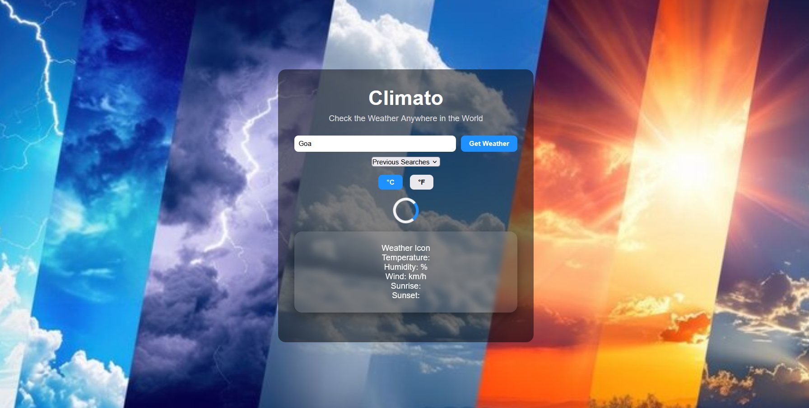
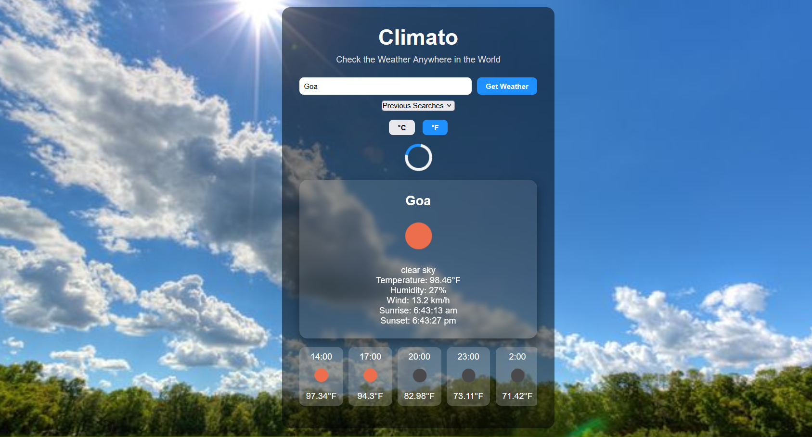
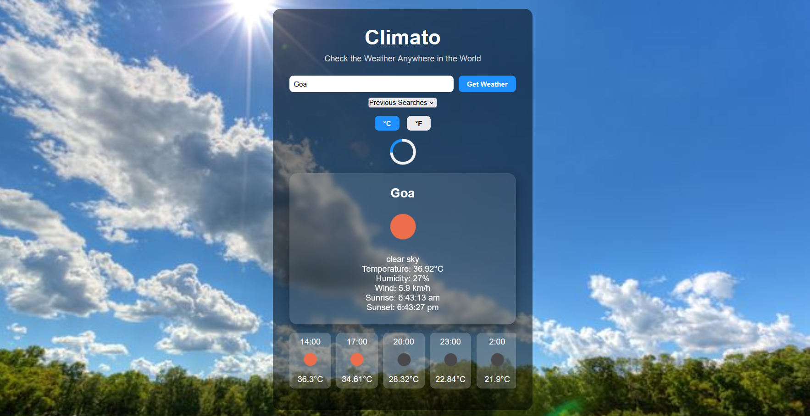
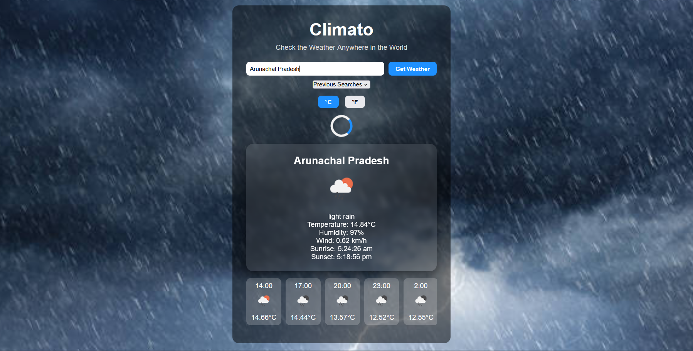
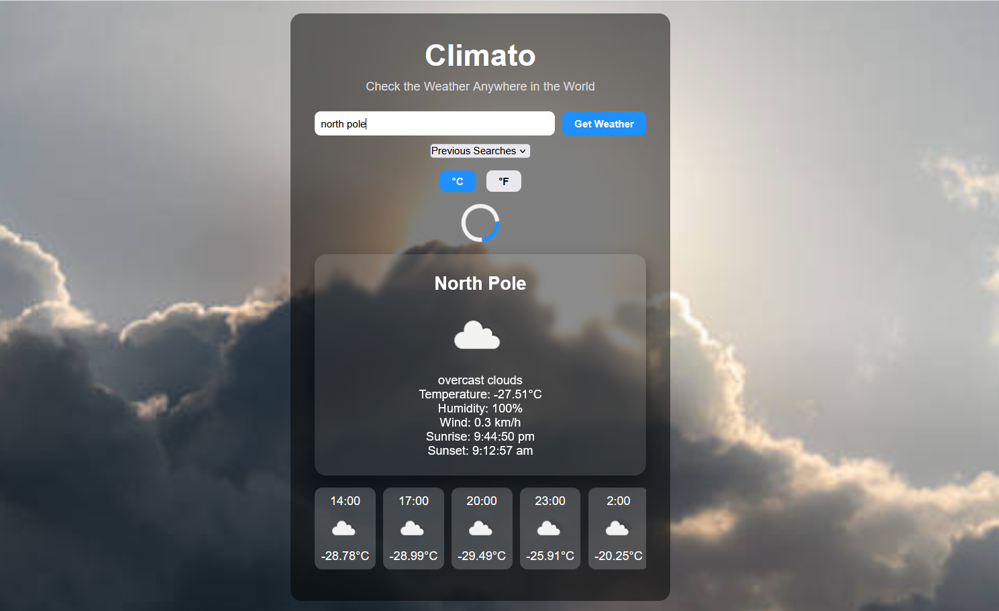

# Climato | Real-Time Weather App

**Check the Weather Anywhere in the World**  

Climato is a modern, responsive, and professional weather application that allows users to check the current weather of any city in real-time. The app integrates with the OpenWeatherMap API, providing temperature, humidity, wind speed, sunrise/sunset times, and weather descriptions, along with a dynamic hourly forecast.

---
  
**1️. Main Weather Card**
  
**2.Background Changing Sunny in Sunny region showing temperature in  in Ferrenheit**
  
**3.Background Changing Sunny in Sunny region showing temperature in  in Celcius**
  
**4.Background Changing rainy in Rainy region showing temperature in  in Ferrenheit**
  
**5.Background Changing cloudy in Cloudy region showing temperature in  in Ferrenheit**

## 📝 Description

Climato is designed to be **recruiter-friendly and portfolio-ready**, featuring:  

- Real-time weather updates for any city worldwide  
- Dynamic backgrounds based on current weather conditions (sunny, cloudy, rainy)  
- Hourly forecast cards with smooth horizontal scrolling  
- Temperature toggle between °C and °F  
- Search history dropdown for previously searched cities  
- Responsive design for mobile and desktop  
- Loader animation while fetching data  
- Error messages displayed inside the card  
- Professional card layout with weather icons, descriptions, and extra details like wind and sunrise/sunset  

Climato demonstrates **API integration, modern JavaScript, responsive UI, and clean UX design** — perfect for showcasing in portfolios.

---

## ⚡ Features

- **Real-time Weather Data** using OpenWeatherMap API  
- **Hourly Forecast** cards  
- **Dynamic Backgrounds** based on weather conditions  
- **Temperature Toggle** (°C / °F)  
- **Search History Dropdown**  
- **Loader / Spinner** while fetching data  
- **Responsive Design** for desktop and mobile  
- **Professional Card Layout**  

---

## 🛠️ Tech Stack

- HTML5 / CSS3 / JavaScript (ES6)  
- OpenWeatherMap API  
- LocalStorage for search history  
- Responsive design principles  

---

## 🚀 How to Run

1.Clone the repository
git clone https://github.com/yourusername/climato-weather-app.git
----------------------------
2.Navigate into the project folder

cd climato-weather-app
----------------------------

3.Get your free OpenWeatherMap API key

Go to https://openweathermap.org/api
Sign up and generate an API key.
----------------------------

4.Add your API key
Open script.js and replace:

const API_KEY = "YOUR_API_KEY";

with your actual API key.
----------------------------

5.Run the project
Simply open index.html in your browser.

No installation required 🎉

## 🚀 👨‍💻 Author

Ashish Kadam

If you like this project, feel free to connect with me 👇

LinkedIn: https://linkedin.com/in/yourprofile
GitHub: https://github.com/yourusername